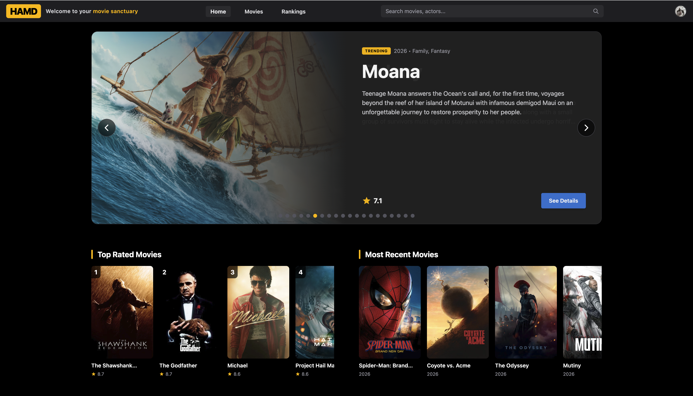
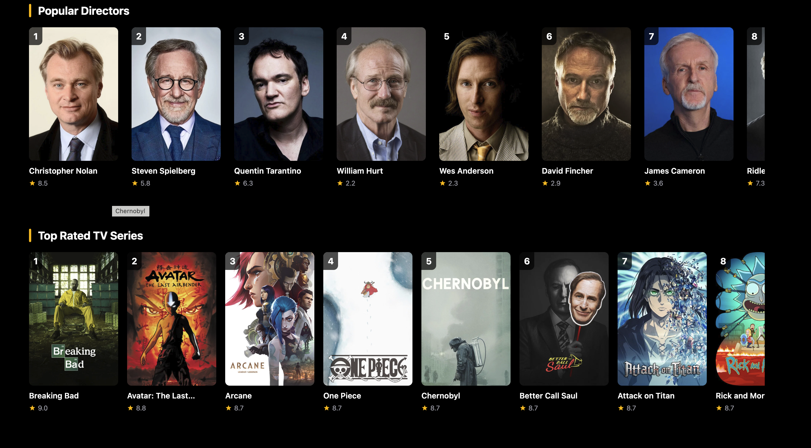
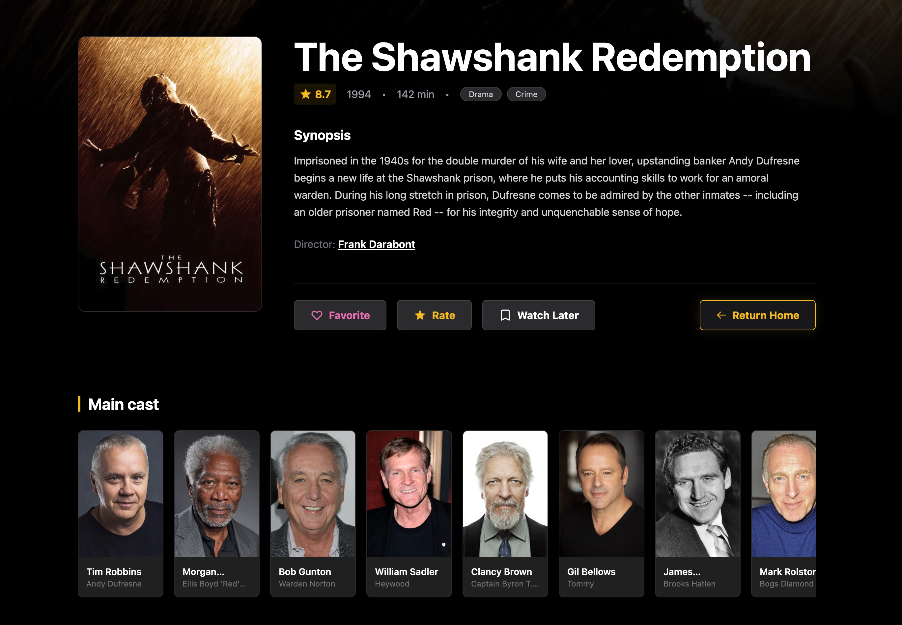
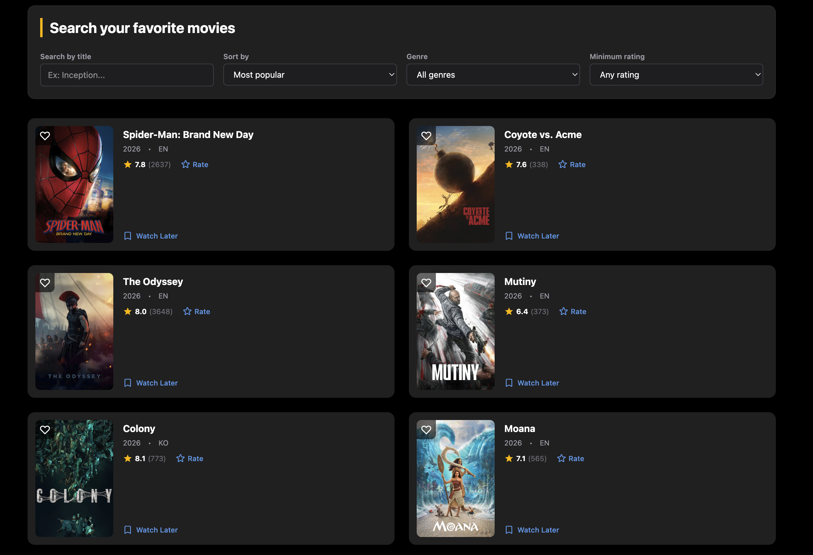
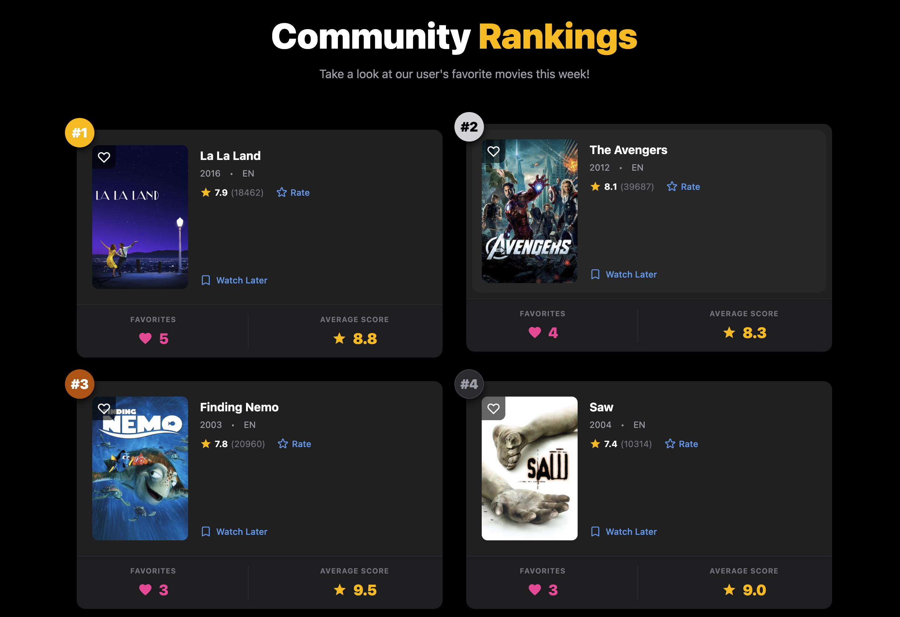
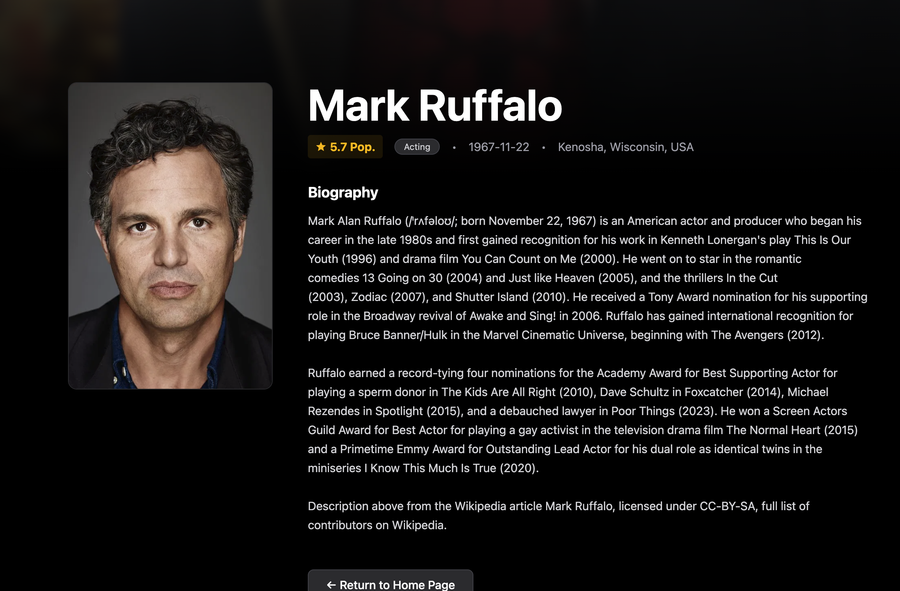
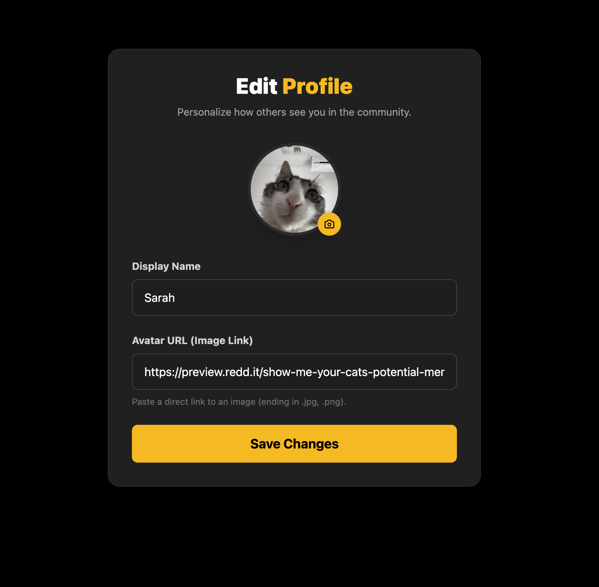
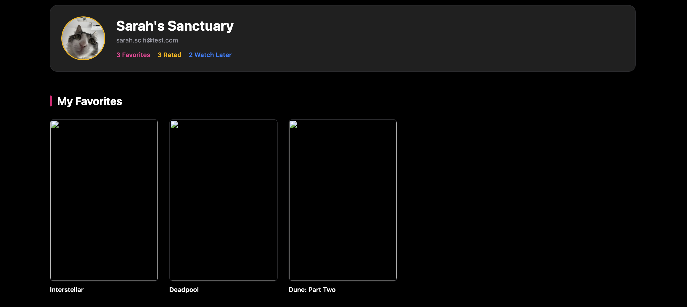

# HAMD — Movie Sanctuary by Héctor & Albert

HAMD is a modern, responsive cinephile web application built with Angular, Tailwind CSS, and TypeScript. The platform allows users to explore trending and top-rated movies, discover popular directors and TV series, perform advanced multi-criteria searches, inspect detailed film and cast information, rate titles, save entries to their personal sanctuary, and check community rankings.

---

## How the app works

The application is structured around an intuitive entertainment portal that integrates:

- A persistent **navigation header** with real-time search and profile shortcuts.
- A dynamic **featured hero carousel** for trending titles.
- Curated carousels for **Top Rated Movies** and **Most Recent Releases**.
- Dedicated showcases for **Popular Directors** and **Top Rated TV Series**.
- A **detailed movie overview page** including full synopsis, metadata, action buttons, and cast credits.
- An **advanced movie search and filtering engine**.
- A **community rankings** leaderboard tracking top-voted titles.
- An **actor profile page** featuring biographic data and filmographies.
- A personalized **user sanctuary** to manage favorites, rated items, and watchlists, alongside an **edit profile modal**.



### User flow

1. The user lands on the home dashboard, greeted by trending cinema highlights in the hero carousel.
2. They can explore curated sections for top movies, new releases, acclaimed directors, and popular TV series.
3. Users can search directly from the header or access the dedicated search page to filter titles by genre, sort order, and rating.
4. Clicking any movie opens its detailed view to read the synopsis, check the cast, rate the title, or save it to "Favorites" or "Watch Later".
5. Selecting an actor or director opens their profile, detailing their biography and career highlights.
6. Users can navigate to the community rankings page to see what films are trending among peers or visit their private profile sanctuary to manage their saved lists and account details.

---

## Main components

### Header

The `Header` component displays the HAMD branding, a quick navigation menu (`Home`, `Movies`, `Rankings`), a direct search input, and a user profile shortcut avatar.


### Hero & Home Catalogs

The main landing view integrates a rotating hero banner for featured movies along with horizontal scroll carousels for top-rated films and recent debuts.


### Directors & TV Series Showcases

Dedicated sections highlighting influential directors and acclaimed television series, displaying community ratings and direct navigation links.



### Movie Details & Cast

The movie details view presents comprehensive metadata (release year, runtime, genre tags, user score), director credits, a full synopsis, quick action triggers (`Favorite`, `Rate`, `Watch Later`), and an interactive cast list with headshots.



### Search & Filtering

The search module allows users to filter the catalog using live text queries, sort order criteria (e.g., *Most Popular*), genre multi-selection, and minimum star-rating thresholds.



### Community Rankings

The `Community Rankings` view aggregates community engagement metrics, highlighting weekly top-ranked films alongside total favorite counts and average scores.



### Person / Actor Profile

Displays biographical details, birth date, birthplace, popularity score, and biography sourced from encyclopedia entries and movie databases.



### Profile & Sanctuary

A personal hub where users can customize their avatar image and display name, as well as browse through their saved lists (*Favorites*, *Rated*, *Watch Later*).




---

## Project structure

Complete folder structure for the project (workspace root):

```text
Movies-Hector-Albert/
    .editorconfig
    .gitignore
    .postcssrc.json
    .prettierrc
    angular.json
    package.json
    package-lock.json
    README.md
    tsconfig.app.json
    tsconfig.json
    tsconfig.spec.json
    .vscode/
        extensions.json
        launch.json
        tasks.json
    docs/
        readme-assets/
    public/
        favicon.ico
    src/
        index.html
        main.ts
        styles.css
        app/
            app.config.ts
            app.css
            app.html
            app.routes.ts
            app.spec.ts
            app.ts
            models/
                actor-interface.ts
                director-interface.ts
                movie-interface.ts
            services/
                api-service/
                    api-service.spec.ts
                    api-service.ts
```

---

## Technology stack

- Angular (Standalone Components, Signals & Reactive Architecture)
- Tailwind CSS
- TypeScript
- Vitest unit testing suite
- REST API Integration (`api-service.ts`)

---

## Run locally

Install dependencies:

```bash
npm install
```

Start the dev server:

```bash
ng serve
```

Open the app at:

```text
http://localhost:4200/
```

---

## Tests

Run unit tests with:

```bash
npm test
```

This project includes spec test files covering components and the API service (`api-service.spec.ts`, `app.spec.ts`).

---

## Deployment with Vercel

The application can be deployed to Vercel with standard Angular build parameters:

1. Connect the repository to Vercel.
2. Set the build command to:

```bash
npm run build
```

3. Set the output directory to:

```text
dist/Movies-Hector-Albert
```

4. Deploy.

### Vercel configuration file (example)

You can place a `vercel.json` at the project root to configure routing and static output:

```json
{
  "version": 2,
  "builds": [
    {
      "src": "package.json",
      "use": "@vercel/static-build",
      "config": { "distDir": "dist/Movies-Hector-Albert" }
    }
  ],
  "routes": [
    { "src": "/(.*)", "dest": "/index.html" }
  ]
}
```

---

## Notes

- Dark-themed design built with Tailwind CSS utilities.
- Responsive layout supporting mobile, tablet, and desktop viewports.
- Integrated data layer handling movies, actors, and director information.

---

## Assets

Screenshots used for this README are stored in `docs/readme-assets/`.

---

## License & Credits

Developed by:

- **Héctor**
- **Albert Muntal Perez**
  - GitHub: [https://github.com/DrMunty](https://github.com/DrMunty)
  - LinkedIn: [https://www.linkedin.com/in/albert-muntal-perez-a626a0120/](https://www.linkedin.com/in/albert-muntal-perez-a626a0120/)
